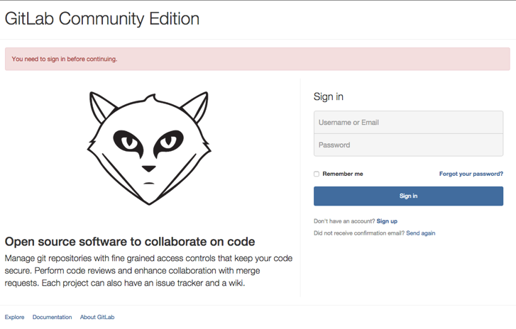
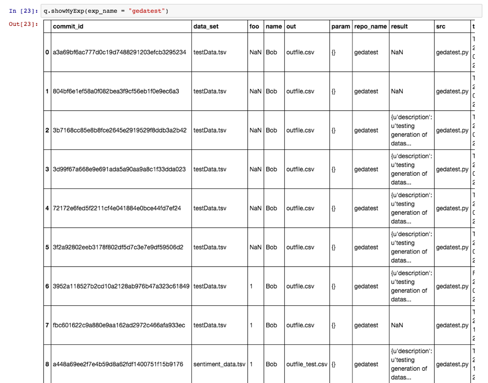
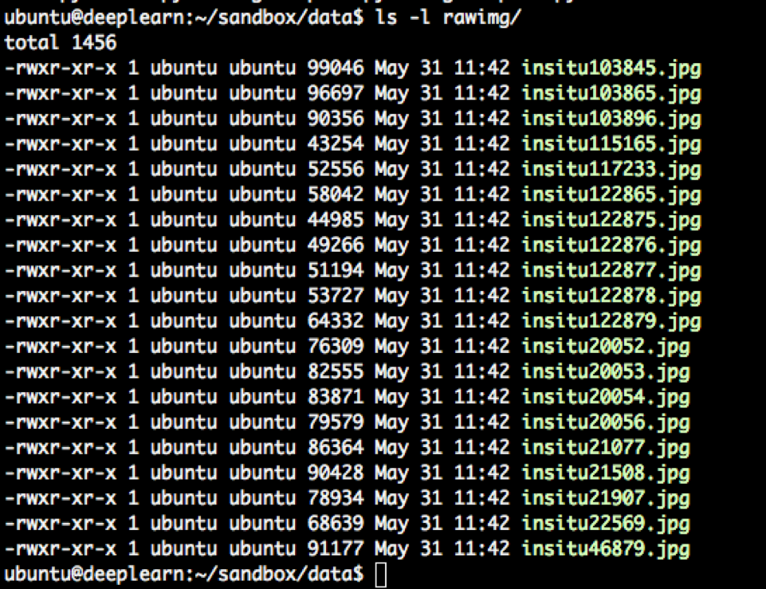
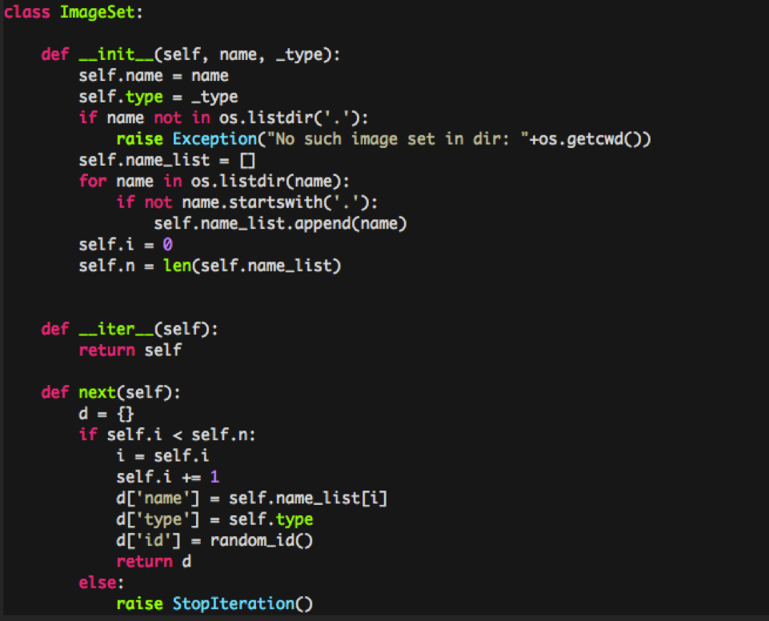
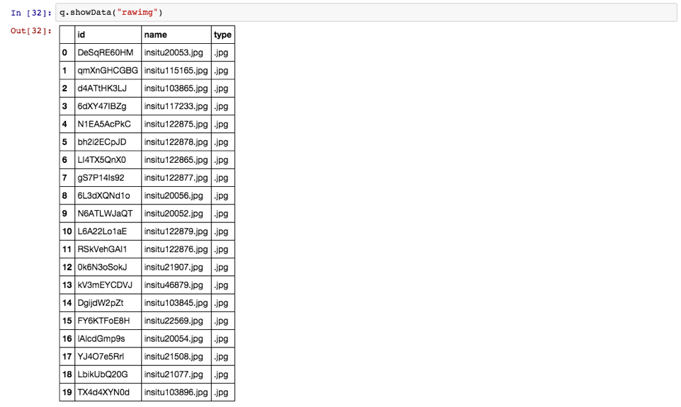

# LSEMS
> This is the manual for LSEMS (Data Hub system)
> > LSEMS stands for Large Scale Experiment Management System

##Introduction

###Background
This project is initially determined to run a Bioinformatics experiment in large scale systems for efficiency. It involves multiple stages of image processing followed by a machine learning process. As a result, some image processing application is integrated into system, e.g. _Fiji_ and _EBImage_ (in R).

###Purpose
In this project, we introduce an integrated solution to the management and analysis of data mining and machine learning experiments in Bioinformatics and other fields. The purpose of the system is to manage experiment (information of the experiment), metadata (experiment results, etc.) and data sets in a more organised and logical way, with the help of multiple open source projects: a version control system to handle experiment/code logic (e.g. Gitlab) and a NoSQL database with designed data structure to handle metadata and data sets (e.g. MongoDB). Such logics include but not limited to experiment code versioning, data set lineage and joint view. Further more, the system has a strong expandability for experiments with different environment demands. Various languages are supported and large scale distributed computing system (e.g. Hadoop & Spark) are also available for faster processing speed on big datas.

##Structure
The system is developed on two open source project:

- [Gitlab](http://about.gitlab.com)
- [MongoDB](http://www.mongodb.org)

with the help of other python packages, such as

- web.py
- pymongo
- pandas

The system contains 4 parts, as shown in the graph.

- User communicate with the ___System Core___ for information and operations, e.g. import data set, get experiment information.
- User manage their experiment codes on ___Gitlab Server___ while each push operation triggers _System Core_ to clone and run the code if necessary.
- The _System Core_ communicates with ___MongoDB Server___ for management of data set and experiment data (metadata).
- The _System Core_ may access to a ___Large Scale Cluster___ for more computational power.

##Pipeline
The code manage and auto-run system runs in a pipeline as shown below

- User pushes code to GitLab Server, the server POST to system core through web hook.
- System core clones the repository to local directory.
- Read experiment info from `exp.json` and upload it into `users` db in MongoDB server.
- Copy experiment code to sandbox and run.
- Record output metadata from `output.json` into database in MongoDB server.
- Import output dataset (if any) into `datas` db in MongoDB server.
- Finishes.

##Data Model

The system is based on separation of "data" and "metadata". According to [Wikipedia](https://en.wikipedia.org/wiki/Metadata), metadata is defined as follows:

- Metadata (metacontent) is defined as the data providing information about one or more aspects of the data, such as:
	- Means of creation of the data
	- Purpose of the data
	- Time and date of creation
	- Creator or author of the data
	- Location on a computer network where the data was created
	- Standards used

In our data model, the datas we deal with are largely statical, we conduct experiment on them and perhaps generate new data sets. Rather than data, it is metadata for which a powerful and flexible system is needed. Further more, datas may be of huge size, e.g. gigabytes of image or log file (Big Data). It's relatively impossible to load everything into the database, yet we want to keep an archive of the datas and keep track of how they change through time. Thus, we load only those metadata we care about into the database and dynamically track them through experiments.

As shown in the above graph, the management of data and metadata are on the left part where a file system is in charge of holding the datas and unstructured datas are structured and imported into the database. On the right side, the process of experiment is inferred which dynamically manipulates datasets in the database. Also joint view is supported in the system.

##Tutorial
This tutorial will lead you through the pipeline with examples of the system's key functionalities.
### Registration
- After connecting to VPN, type <http://10.2.2.31> to open the main page of GitLab for registration.

### Make a New Project
- Click `new Project` button to make a new project.
- You can find all your projects in GitLab.

### Enter into Data Hub IPython Notebook Web Server

- After connecting to VPN, type <http://10.2.2.32:7777> to open the data hub IPython Notebook Web Server.

- The file `sample.ipynb` under the current directory is a tutorial of Data Hub. Click the `new` button on the upper-right corner, you can create a folder named with your Gitlab account name.

- Enter the new folder and create an IPython Notebook (click the `Python 2` in the above column). The following view will come up:

### Inspect Data Set

- First, enter directory `~/LSEMS`

- Then, `import query` and create a Query object.

- by enter `q.` and press `tab` you can check the `query` functions available.

- after completion of function name, enter `?` to see related documents and examples. e.g. enter `q.importData?` will get the following information.

- another e.g. enter `q.showData()` will return the names of registered data sets in the database.

### Inspect Data Set Info and Dependencies

- enter `q.showDescription("data_set_name")` will return the data set's information including dependencies, e.g. `parent` attribute.

- Some of the attribute in the description may be complicated, enter the attribute's name for detailed information.

- enter `q.showData("data_set_name")` will return the data set's metadata.

### Join Operation of Data Sets

- There are circumstances when multiple data sets with the same primary key recorded metadata of same experiment, then we can join them for a better view of the data set.

### Experiment Submission

- Initiate experiment repository and prepare the data set.

- Since LSEMS manage "data" and "metadata" separately, you need to download a sample of the experiment data set when you do the coding and testing. Access the FTP server at <ftp://10.2.2.146:12314/> (name: `user`, pass: `abc123`) for these sample datas.

- while submitting code, the repository should have directory structure as follows:

		/exp_name/
				  src/
				 	  example.py
				 	  outAPI.py
				 	  ...
				  exp.json

- where `exp.json` should meet up with following requirements:
    - Required entries:
        - `data_set`: the input data set you are using, which should have been registerd in the database.
        - `src`: the source file of your program, the one will be run by the system.- `type`: the type of language using.
        - `param`: parameters for this run, set an empty dict if none.
    - Optional entries:
        - `out`: name of the data set your code would generate for registation.
- here's an example `exp.json` file:

- src contains 2 files:
    - `outAPI.py`, the output api provided to suit the system output recording mechanism. (will be providing package support, won't be in use soon)
    - `gedatest.py`, users main experiment code, which will read in a `scv` data set, add a new attribute to it and out put as a new data set.

            from pandas import *
            from outAPI import *

            def main():
                df = read_csv("../data/sentiment_data.tsv", delimiter='\t', quoting=1)
                df['attr'] = range(len(df))
                fp = open('outfile_test.csv', 'w')
                fp.write(df.to_csv())
                fp.close()
                O = Outer()
                O.jout_exp({'description':'testing generation of datasets.'})
                O.generate()

            if __name__ == "__main__":
                main()

### Inspect Experiment Result

- enter `q.showMyExp()` in the IPython Notebook will return names of all your experiments.

- pass the name of the experiment to the function will return all submission infos.

### Import Data Set into database

- Since the data and metadata are managed separately, data sets need to be registered after upload for metadata to be recorded.

- There are 2 kinds of datas:
    - Structured data, e.g. `csv` and `tsv` are supported in the system
    - Unstructured data, e.g. bunch of images or logs, for which user need to define the rule to import dataset.

- To import a structured data set, use `q.importData("data_set_name")` in the data set's directory, and call `q.showData()` to see if succeeded.

- To import an unstructured data such as a bunch of images in a `rawimg` directory:

- a user-defined import class (iterator) is needed, e.g.

- Import this class and pass it as the `it` attribute, and check if succeeded.

- The data set imported with the user defined class looks like this

## Code Documentation

### Running Experiments

- In file `hook.py`, a `web.py` server is run for receiving posts from Gitlab web hook, it will trigger new process of `exp.py`.
- In file `exp.py`:
	- __`exp`__`(data)`:
		- start running the experiment by cloning the experiment repository to local and call `read()` in `run.py`.
		- ___parameters:___
			- `data`: dict, pass the json recieved in the post which contains experiment info.
- In file `run.py`:
	- __`verifyUser`__`(client, name)`:
		- it takes in the name to be verified and contact the server if the user exists, create it if not.
		- ___parameters:___
			- `client`: `MongoClient` object connected to the server.
			- `name`: string, the name to be verified.
		- ___output:___
			- the MongoDB collection with the name being verified (might have just been created).
	- __`record`__`(params, git_info = {}, DB_addr = default_address)`:
		- this functions enrich params with metadatas and record it in the corresponding file of the user's collection before run it.
		- ___parameters:___
			- `params`: dict, parameters read from `exp.json`.
			- `git_info`: dict, necessary git information.
			- `DB_addr`: string, MongoDB address.
		- ___output___
			- success flag and augmented params
	- __`run`__`(params)`:
		- switch to sand box directory and run the experiment code.
		- ___parameters:___
			- `params`: dict, augmented params of experiment.
	- __`save_results`__`(file_name, params, DB_addr = default_address)`:
		- save experiment results to corresponding file in the user's collection.
		- ___parameters___:
			- `file_name`: string, name of output file.
			- `params`: dict, augmented params of experiment.
			- `DB_addr`: string, MongoDB address.
	- __`read`__`(file_name, git_info)`
		- read experiment parameters and call `record()` and `run()` to proceed experiment.
		- ___parameters___:
			- `file_name`: string, file name to load experiment parameters.
			- `git_info`: dict, necessary git information.

### Data Management

- In file `data.py`:
	- `class` __`Data`__:
		- structure of a single MongoDB collection to manipulate on, super class of `DSData` and `ExpData`.
		- `Data.__init__(self, Database, name)`:
			- construction of object `Data`
			- ___parameters:___
				- `Database`: `Database` object indicating the database using.
				- `name`: string, the name of the collection.
		- `Data.`__`record`__`(self, _id, _dict)`:
			- update MongoDB file of id with dict.
			- ___parameters:___
				- `_id`: string, the identical id of the file.
				- `_dict`: dict, the dict to update.
		- `Data.`__`show`__`(self, _id)`:
			- show dile with particular id
			- ___parameters:___
				- `_id`: string, the identical id of the file.
			- ___output:___
				- the file required as a dict.
		- `Data.`__`show_all`__`(self)`:
			- show all files in the collection.
			- ___output:___
				- required files as a list of dicts.
	- `class` __`DSData`__:
		- structure of data set MongoDB collection, sub-class of `Data`.
		- `DSData.`__`find_parent`__`(self)`:
			- find where the data set derived from, if there's any.
			- ___output:___
				- name of the parent data set as string, `None` if no parent.
		- `DSData.`__`find_root`__`(self)`:
			- find the origin of the data set.
			- ___output:___
				- name of the root data set as string, `None` if no parent.
		- `DSData.`__`show_info`__`(self)`:
			- return the information of the data set.
			- ___output:___
				- information of the data set as a `DataFrame` object.
		- `DSData.`__`show_data`__`(self)`:
			- return the datas in the data set.
			- ___output:___
				- files in the data set (a MongoDB collection object) as a `DataFrame` object.
		- `DSData.`__`diff`__`(self, commit_id1="", commit_id2="")`
			- find the difference in attributes of this data set over different times of experiments.
			- ___parameters:___
				- `commit_id1` and `commit_id2`: string, indicating the different times of experiments. Take the latest two commits when left blank.
			- ___output:___
				- difference in attributes as a `DataFrame` object.
	- `class` __`ExpData`__:
		- structure of a particular user and its experiment information, over a  MongoDB collection, sub-class of `Data.`
		- `ExpData.`__`show_exp_names`__`(self)`:
			- show all experiment names of the user.
			- ___output:___
				- experiment names as a DataFrame object.
		- `ExpData.`__`show_exp`__`(self, name)`:
			- show information of a particular experiment.
			- ___parameters:___
				- `name`: string, the requested experiment name.
			- ___output:___
				- experiment information as a `DataFrame` object.
		- `ExpData.`__`diff`__`(self, exp_name, commit_id1="", commit_id2="", show=[])`:
			- find difference in parameters of an experiment over different times of experiment.
			- ___parameters:___
				- `exp_name`: string, the requested name of the experiment.
				- `commit_id1` and `commit_id2`: string,  commit ids to compare over. Take the latest two commits when left blank.
				- `show`: list of strings, attributes hope to show. Show all when passed empty list.
			- ___output:___
				- difference of experiment information in `DataFrame` object.
		- `ExpData.`__`diff_result`__`(self, exp_name, commit_id1='', commit_id2='')`:
			- ___parameters:___
				- `exp_name`: string, the requested name of the experiment.
				- `commit_id1` and `commit_id2`: string,  commit ids to compare over. Take the latest two commits when left blank.
			- ___output:___
				- difference of experiment results in `DataFrame` object.
	- `class` __`Database`__:
		- structure of a MongoDB client connected to the server.
		- `Database.__init__.(self, db="datas", address = default_address)`:
			- construction of object `Database`
			- ___parameters:___
				- `db`: string, database name in the MongoDB server.
				- `address`: string, the server address.
		- `Database.`__`import_data`__`(self, name, description="", parent="", ignore=[], it=None, _type="")`:
			- import data sets into the database. For now only `*sv` (e.g. CSV, TSV) format are supported. User defined import iterator are allowed into the function.
			- ___parameters:___
				- `name`: string, file name of the data to be imported.
				- `description`: string, description of the data set.
				- `parent`: string, the name of the data set it derived from.
				- `ignore`: list of string, names of attributes not to import into the database. This is important for the system to tell which part of the file is data or metadata. Main volume of data should not be imported into the database.
				- `it`: class, the import iterator class user defined to import alternative type of data.
				- `_type`: string, the type of data set, e.g. "csv", "image"
		- `Database.`__`generate_data`__`(self, name, description="", parent="", ignore=[])`:
			- used when new data set is generated from old one, including copying new data file to correct place.
			- ___parameters:___ see `Database.import_data()`
		- `Database.`__`join`__`(self, name, name_list=[], key='_id')`:
			- create joined view of for two data sets in the database. Only collections in database `datas` is allowed.
			- ___parameters:___
				- `name`: string, name of the base data set.
				- `name_list`: list of string, names of data sets to be joined.
				- `key`: string, the main key of the join operation.
			- ___output:___
				- joined datas as a list of ditcs.
		- `Database.`__`get_data`__`(self, name)`:
			- get one data set from the database.
			- ___parameters:___
				- `name`: string, name of requesting data set.
			- ___output:___
				- `ExpData` or `DSData` object of  the data set.
	- `class` __`View`__:
		- providing joined view for datasets in database.
		- `View.__init__(self, database, name, name_list=[], key="id")`
			- construction of `View` object.
			- ___parameters:___
				- `database`: `Database` object
				- `name`: string, name of the base data set.
				- `name_list`: list of string, names of data sets to be joined.
				- `key`: string, the main key of the join operation.
		- `View.`__`get`__`(self, pair)`:
			- conduct lazy evaluation on the file containing certain key-value pair.
			- ___parameters:___
				- `pair`: dict, key-value pair for MongoDB to search for file.
			- ___output:___
				- requested MongoDB file as a dict.
		- `View.`__`dump`__`(self)`:
			- dump the whole joint view.
			- ___output:___
				- joint view as list of dicts.
		- `View.`__`dump_df`__`(self)`:
			- dump joint view as `DataFrame`.
- In file `query.py`:
	- query application build over `data.py`, with practical commands on databases.
	- `class` __`Query`__:
		- querier class holding all commands.
		- `Query.__init__(self, name)`
			- construction of Query object
			- ___parameters:___
				- `name`: string, user name.
		- `Query.`__`showData`__`(self, dataName = None, attribute = None)`:
			- Show all the name of data sets or one specific data set.
			- ___parameters:___
				- `dataName` : string, The name of one specific data set.
				- `attribute` : string, The attribute of thie data set.
			- ___output:___
				- data set names as list of strings.
		- `Query.`__`showDataDescription`__`(self, dataName = None, attribute = None)`:
			- Show the description of one data set.
			- ___parameters:___
				- `dataName` : string, The name of this data set.
				- `attribute` : string, The attribute of your data description.
			- ___output:___
				- data set information as a `DataFrame` object.
		- `Query.`__`showUser`__`(self)`
			- Show all the users in the system.
			- ___output:___
				- users' names in the database as a `DataFrame` object.
		- `Query.`__`showMyExp`__`(self, exp_name = None, attribute = None)`:
			- Show all your experiment records.
			- ___parameters:___
				- `exp_name` : string, The name of your experiment.
				- `attribute` : string, The attribute of your experiment information.
			- ___output:___
				- experiment records as a `DataFrame` object.
		- `Query.`__`importData`__`(self, dataName = None, description = "", parent = "", ignore = [], it = None, _type = "")`:
			- Import your data set into system.
			- ___parameters:___
				- `dataName` : string, The name of your data set (with dir path).
				- `description` : string, The description of this data set.
				- `parent` : string, Paratent data set of this new data set.
				- `ignore` : list, Attributes that want to be ignored.
				- `it` : class file, The python class to import data iteratively.
				- `_type` : string, The type of import data set.
		- `Query.`__`joinView`__`(self, dataName, name_list, key)`:
			- Joint two or more datasets with a specific key.
			- ___parameters:___
				- `dataName` : string, the name of dataset you want to be joined.
				- `name_list` : list, The name list of datasets you want to join.
				- `key` : string, The primary key.
			- ___output:___
				- dumped joint view as a `DataFrame` object.
		- `Query.`__`diffExp`__`(self, expName = None)`:
			- Check the difference between the last two experiments.
			- ___parameters:___
				- `expName` : string, The name of your experiment.
			- ___output:___
				- difference of experiment results in `DataFrame` object.

### Output APIs

- In file `outAPI.py`:
	-  API for experiment codes in Python to generate formated output file for the system.
	- `class` __`Outer`__:
		- output container class.
		- `Outer.__init__(self, file_name = "output")`
			- construction of `Outer` object.
			- ___parameters:___
				- `file_name`: string, name of the output file.
		- `Outer.`__`nout`__`(self, content)`:
			- non json outputs, takes plain string.
			- ___parameters:___
				- `content`: string, plain text for output.
		- `Outer.`__`jout_exp`__`(self, d)`:
			- json outputs for whole experiment, takes dictionary(appending).
			- ___parameters:___
				- `d`: dict, output attributes.
		- `Outer.`__`jout_expS`__`(self, a, b)`:
			- json outputs for whole experiment, takes key-value pair.
			- ___parameters:___
				- `a`: key, output attributes name.
				- `b`: value, output attribute value.
		- `Outer.`__`generate`__`(self)`:
			- generates output file according to put in data, with "`self.name`.json" for structured output, and "`self.name`.txt" for plain text.
